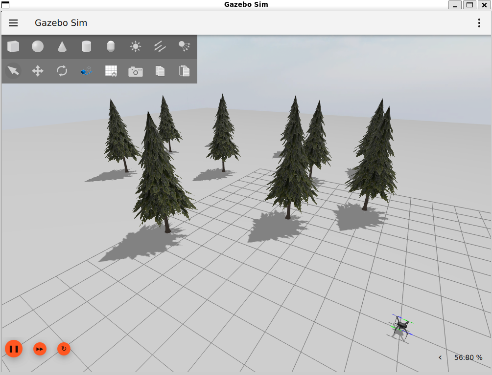
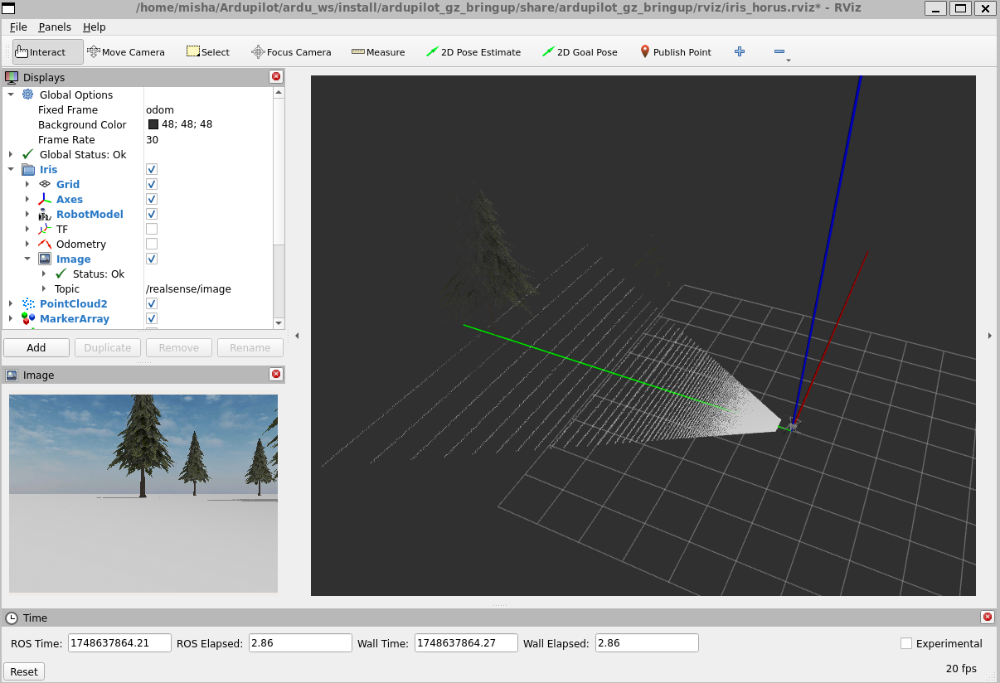
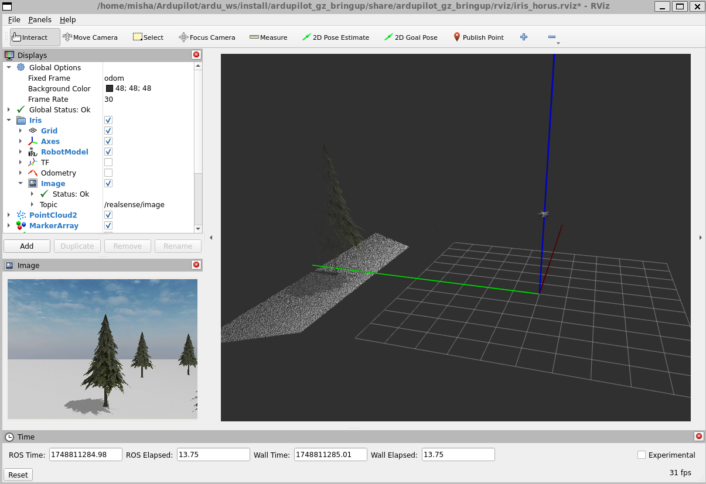
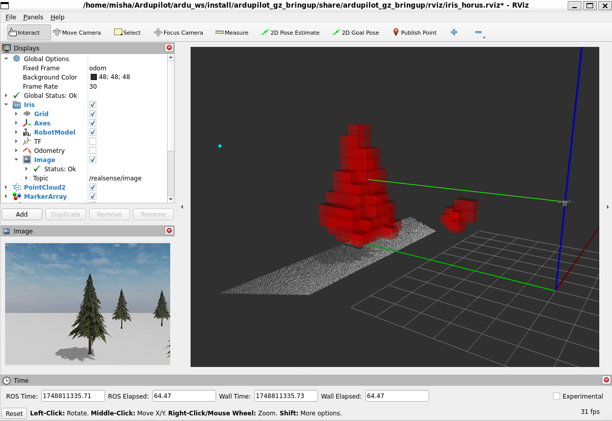
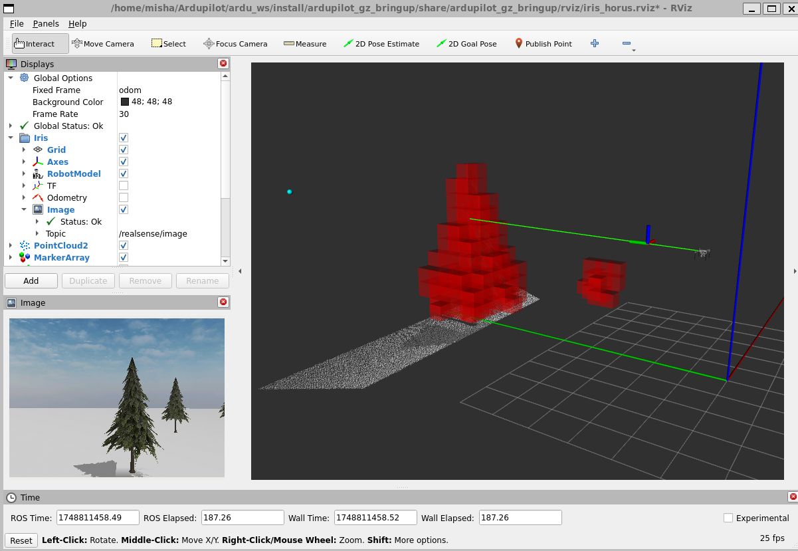
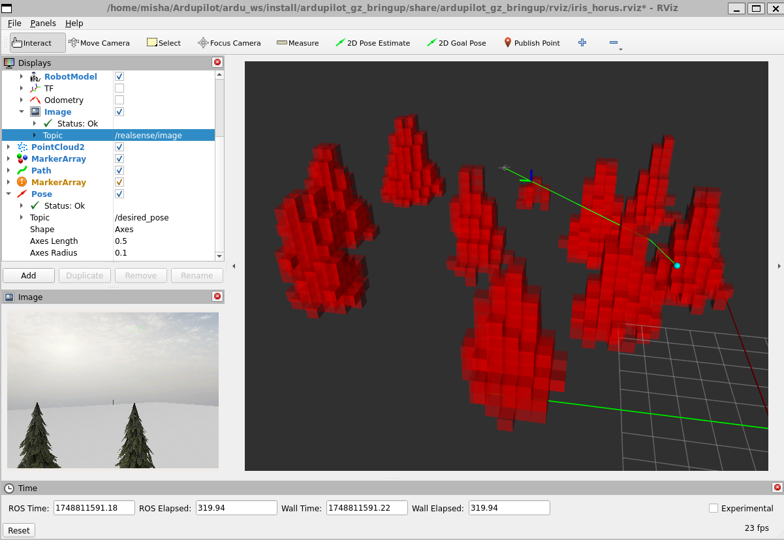

## Welcome to Horus

**Horus** is an end-to-end autonomy stack for ArduPilot/PX4 drones, built with ROS 2. It focuses on enabling 3D drone navigation in cluttered environments using onboard perception, planning, and control. Currently, it integrates with ArduPilot SITL, with PX4 support coming soon.

The system is in early development and not yet capable of effective navigation through dense obstacles, but this challenge actively drives its design and long-term vision.

### 📦 Architecture Overview

The autonomy stack is organized into three major subsystems:

- **Perception** – Environment sensing and map generation
- **Task Planning** – High-level decision making and mission logic
- **Motion Control** – Path planning and control for executing navigation tasks


### 👁️ Perception

The **Perception** subsystem currently includes the `Mapper` node, which converts point clouds into a voxel grid. Future integration includes:

- **ORB-SLAM3** for visual odometry and landmark tracking
- **Object detection** for semantic awareness

Source: `src/perception/nodes`


### 🧠 Task Planning

This subsystem is under development. It will be based on a **finite state machine (FSM)** for executing mission-level logic. A future feature includes integrating an **LLM agent** to convert natural language prompts into FSMs composed of pre-implemented task primitives.


### 🚀 Motion Control

The most developed part of the stack, **Motion Control** is organized into a hierarchical structure:

- `GlobalPlanner`: Selects global waypoints to avoid static, large-scale obstacles  
- `LocalPlanner`: Navigates to the next global waypoint while avoiding dynamic/local obstacles  
- `TrajectoryController`: Follows paths generated by the `LocalPlanner` using pure pursuit

Source: `src/motion_control/nodes`

> Note: `GlobalPlanner` currently selects random goals. A PRM-based planner is in development.


### 🧪 Testing

- **Unit Tests**: Implemented using `gtest`, located in `test/tests.cpp`
- **Hardware Testing**: Upcoming on Raspberry Pi 5 + Pixhawk 2.4.8

Stay tuned for updates!
## 📋 Requirements
- Ubuntu 22.04 (we use WSL2)
- ROS2 Humble
- Gazebo Harmonic
- Ardupilot SITL
## Running
We have been running everything in WSL2 (distro Ubuntu 22.04). Aside from a few rare glitches that require restarting with `wsl --shutdown`, it has been working great.

### Initial Setup
Make sure that ROS2 Humble, Ardupilot SITL, and Gazebo Harmonic are installed following [this guide](https://ardupilot.org/dev/docs/ros2-gazebo.html). 

For this example setup, we will assume that the Ardupilot setup was followed and the workspace is at `~/ardu_ws`.

### Clone
```
mkdir ~/drone_ws/src
cd ~/drone_ws/src
git clone https://github.com/Horus-Technologies/horus.git
```
### Build
```
cd ~/drone_ws/
colcon build
```

### Custom Ardupilot Gazebo Setup for Horus 
To be able to use the custom Gazebo world that contains a Realsense camera and some pine trees, execute this:
```
rm -rf ~/ardu_ws/src/ardupilot_gz
cd ~/ardu_ws/src
git clone -b horus https://github.com/mkuznets23/ardupilot_gz.git
```
This is going to replace the` ardupilot_gz` package that was installed in the  `vcs import` step of [this guide](https://ardupilot.org/dev/docs/ros2-gazebo.html).

After this, rebuild `ardu_ws`:
```
cd ~/ardu_ws
colcon build --packages-up-to ardupilot_gz_bringup
```

### Launch Simulation
```
cd ~/ardu_ws && source install/setup.bash
ros2 launch ardupilot_gz_bringup iris_horus.launch.py
```

You should see the following GUIs pop up:



### Takeoff
Mavproxy or any other ground control software (GCS) can be used to put the drone in the air and ready to receive commands from ROS.

We use Mavproxy for simplicity, which can be installed following [this guide](https://ardupilot.org/mavproxy/). 

Once set up, in another terminal, execute the following:
```
mavproxy.py --master udp:127.0.0.1:14550
```

Now we can switch from mode `STABILIZE` to mode `GUIDED` and perform arming and takeoff by typing the following three commands one by one:
```
mode guided
arm throttle
takeoff 3
```

Now the drone should be in the air as such:


### Run Drone Autonomy

Now open another terminal and run
```
cd ~/drone_ws && source install/setup.bash
ros2 run horus fsm
```
This will spool up the VoxelMapper, LocalPlanner, and GlobalPlanner nodes and you should see the following red voxels and local path as the green line:


Finally to get the drone to start tracking the path with a pure pursuit controller, open up another terminal and run
```
cd ~/drone_ws && source install/setup.bash
ros2 run horus trajectory_controller
```

As long as the drone is in mode `GUIDED`, it should begin flying along the path, with an axes marker indicating the location of its lookahead point:


The drone will fly around from one random global goal point to another, and will maintain a voxel grid like this:


Here is a 10x sped up video of it in action:


## 🤝 Contributions Welcome

This project is in active development, and we welcome any suggestions, advice, or contributions. Feel free to open an issue or start a discussion!

## 🔧 Next Steps
- [ ] Incorporate ORBSLAM3 into **Perception** module for improved drone localization and landmark localization.
- [ ] Finite State Machine for mission logic in **Task Planning**
- [ ] `ProbabilisticRoadmap` for `GlobalPlanner`
- [ ] Obstacle inflation for a safe clearance buffer.
- [ ] Speed up point cloud voxelization. Currently it takes around 0.5-2.5 seconds to voxelize a single point cloud message, which is a massive bottleneck for the local planner.